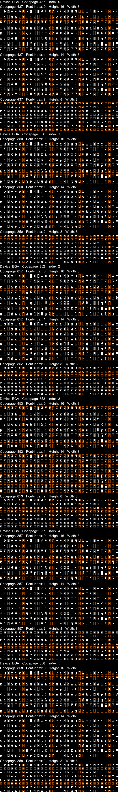

# CPI Font Decoder

This program decodes CPI Fonts (MS-DOS and Linux) and dump to PNG files.
Currently the program does not work with DR-DOS CPI files. To use the program:

- Download or clone the repository.
- `yarn`
- `yarn decode -i [inputFile] -o [outputFile]`

## Example usage

`yarn decode -i ega.cpi -o ega.png`

Note: if the file has an extension of `.cpx`, decompress the file with [UPX](https://upx.github.io/)
first.

## Disclaimer

This is a simple utility program to decode the contents of CPI files for
debugging only. Manual testing is done on the files in
[FreeDOS CPI package](https://www.ibiblio.org/pub/micro/pc-stuff/freedos/files/distributions/1.2/repos/pkg-html/cpidos.html),
but please do not expect automatic testing or CI to be added to the code.

Feel free to page me if you cannot decode a certain font file (please state the source of the file).

## Sample output

The following is the resulting PNG of ega.cpx from FreeDOS CPI package:

